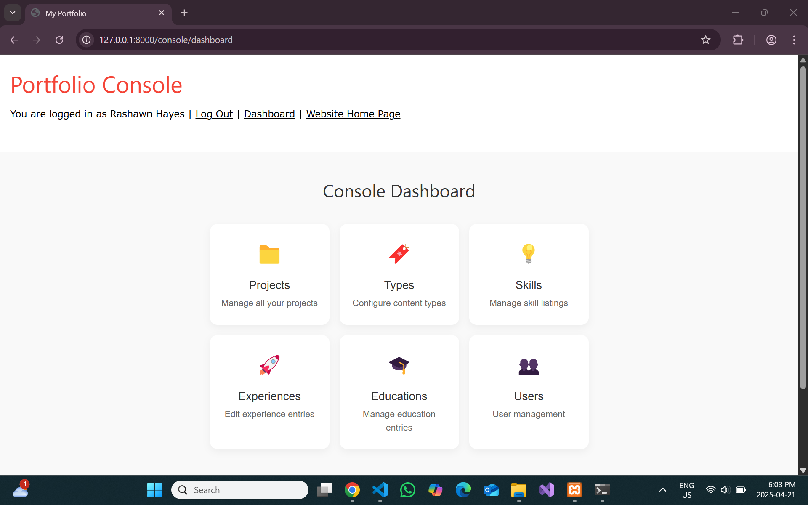

# Laravel Portfolio Admin Panel with frontend

> A Laravel-based admin console for managing the Portfolio. It provides a consistent, responsive UI built with reusable Blade templates and a shared CSS utility library for CRUD operations on Projects, Skills, Experiences, Users, and Educations.

---

## 📂 Repository

[Explore the complete source code on GitHub](https://github.com/dignapatel0/Laravel_Portfolio)

---

## 🚀 Features

- **Resource Management**:
  - **List Views** with responsive tables for managing:
    - **Projects**: View, edit, and delete project details including title, description, type, and image.
    - **Skills**: Manage skills, upload images for each skill with live preview.
    - **Experiences**: Add, edit, or delete professional experience details like job title, company, location, and employment dates.
    - **Educations**: Manage educational background details including institution name, course name, location, and dates.
    - **Users**: Add and manage user details with roles and permissions.

- **Add/Edit Forms**:
  - **Validation Feedback**: Fields are validated, with user-friendly error messages displayed upon submission.
  - **Live Image Upload**: Projects & Skills sections include an image upload feature that displays a live preview before submitting.

- **Image Upload**:
  - **Project Image Upload**: Admins can upload project images directly from the add/edit project page, with a live preview.
  - **Skill Image Upload**: Admins can upload skill images, with a live preview displayed before the form submission.

- **Dashboard**:
  - **Icon-based cards**: A simple, intuitive dashboard with quick access cards to each management section (Projects, Skills, Experiences, etc.).

---

## 🎬 Screenshots

### Login Page  


### Dashboard Overview  


### Manage Projects  


### Add Education  


### Edit Experience  


### Skill Image Upload  


### Live Video Demo of Front end

[Watch the video](./_readme/demo.gif)

---

## 🏁 Getting Started

1. **Clone the repository**  
   ```bash
   git clone https://github.com/dignapatel0/Laravel_Portfolio.git
2. **Navigate to project directory**
    ```bash
    cd Laravel_Portfolio
3. **Install PHP dependencies**
    ```bash
    composer install
4. **Environment setup**
    - Copy .env.example to .env and configure database and storage.
    - Generate application key:
    ```bash
    php artisan key:generate
5. **Database & Storage**
    ```bash
    php artisan migrate:fresh --seed
    php artisan storage:link
6. **Serve the application**
    ```bash
    php artisan serve
- Visit http://localhost:8000/console/login to access the admin panel.


